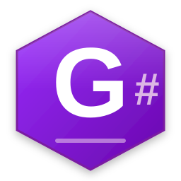

<p align="center">
  
</p>

<h1 align="center">GoonSharp 🟣</h1>

<p align="center">
  <strong>The ultimate shitpost programming language — transpiles to Rust</strong>
</p>

<p align="center">
  <a href="#install">Install</a> •
  <a href="#quick-start">Quick Start</a> •
  <a href="#language-overview">Language</a> •
  <a href="#playground">Playground</a> •
  <a href="#tooling">Tooling</a> •
  <a href="SETUP.md">Setup Guide</a>
</p>

---

## What is GoonSharp?

GoonSharp is a compiled programming language that transpiles to Rust. Your `.goons` source → Rust → native binary. It has its own keywords, type aliases, and meme-flavored syntax, but compiles down to fully optimized machine code through `rustc`.

```
// Hello Goon — The simplest GoonSharp program
goonsesh main() {
    goonprint!("Hello, Goon World! 🟣");
}
```

Every language starts as a meme, but only the real ones ship.

---

## Install

### Via npm (Linux x64)

```bash
npm install -g goonsharp
```

This installs two commands:
- `goonsharp` — the compiler
- `goonhub` — the package manager

### From source (any platform with Rust)

```bash
git clone https://github.com/goonsharp/goonsharp
cd goonsharp
cargo build --workspace --release
```

Binaries at `target/release/goonsharp` and `target/release/goonhub`.

---

## Quick Start

```bash
# Create a new project
goonhub new my_project
cd my_project

# Write some code (src/main.goons is already scaffolded)
# Then build and run:
goonhub run

# Or compile a standalone file:
echo 'goonsesh main() { goonprint!("yeet"); }' > hello.goons
goonsharp hello.goons
```

---

## Language Overview

### Variables

```
goonlet x = 42;            // immutable
goonlet mut y = 0;          // mutable
goonlet name: GoonString = "Alice".to_string();
```

### Functions

```
goonsesh add(a: i69, b: i69) -> i69 {
    a + b
}

goonsquad goonsesh public_fn() {
    // goonsquad = pub
}
```

### Control Flow

```
goonif (score > 100) {
    goonprint!("HIGH SCORE");
} goonnah goonif (score > 50) {
    goonprint!("mid");
} goonnah {
    goonprint!("L");
}
```

### Loops

```
goonfor i goonin 1..=10 {
    goonprint!("{}", i);
}

goonwhile (n < 5) { n = n + 1; }

goonloop {
    goonyeet;       // break
}
```

### Structs & Enums

```
goonstruct Player {
    name: GoonString,
    score: i69,
}

goonenum Direction {
    North,
    South,
    East,
    West,
}

goonmatch d {
    Direction::North => goonprint!("up"),
    _ => goonprint!("other"),
}
```

### Traits

```
goontrait Describable {
    goonsesh describe(&self) -> GoonString;
}

goonimpl Describable goonfor Player {
    goonsesh describe(&self) -> GoonString {
        format!("{} (score: {})", self.name, self.score)
    }
}
```

### Keyword Cheat Sheet

| GoonSharp | Rust | What it do |
|-----------|------|-----------|
| `goonsesh` | `fn` | Function |
| `goonlet` | `let` | Variable |
| `goonif` / `goonnah` | `if` / `else` | Conditionals |
| `goonfor` / `goonin` | `for` / `in` | For loop |
| `goonwhile` | `while` | While loop |
| `goonloop` | `loop` | Infinite loop |
| `goonyeet` | `break` | Break |
| `gooncontinue` | `continue` | Continue |
| `goonreturn` | `return` | Return |
| `goonmatch` | `match` | Pattern match |
| `goonstruct` | `struct` | Struct |
| `goonenum` | `enum` | Enum |
| `goonimpl` | `impl` | Impl block |
| `goontrait` | `trait` | Trait |
| `goonsquad` | `pub` | Public |
| `goonuse` | `use` | Import |
| `goonmod` | `mod` | Module |
| `fax` / `nocap` | `true` | True |
| `cap` | `false` | False |
| `goonprint!` | `println!` | Print |
| `i69` | `i64` | The Nice Integer |
| `GoonString` | `String` | Owned string |
| `goobool` | `bool` | Boolean |

---

## Playground

Try GoonSharp in your browser — no installation needed:

**[goonsharp.dev/#/playground](https://goonsharp.dev/#/playground)**

The playground compiles `.goons` source to Rust entirely client-side using WebAssembly.

---

## CLI Reference

### `goonsharp` — Compiler

```
goonsharp <file.goons>            Compile and run
goonsharp build <file.goons>      Compile only
goonsharp check <file.goons>      Parse check only
goonsharp emit-rust <file.goons>  Show transpiled Rust
goonsharp fmt <file.goons>        Format (cosmetic)
```

### `goonhub` — Package Manager

```
goonhub new <name>       Create a new project
goonhub init             Initialize in current directory
goonhub build            Build the project
goonhub run              Build and run
goonhub test             Run tests
goonhub add <dep>        Add a dependency
goonhub publish          Publish to GoonHub registry
```

---

## Tooling

### VS Code Extension

Full editor support with syntax highlighting, themes, snippets, and file icons.

```bash
code --install-extension editors/vscode/goonsharp-69.0.0.vsix
```

Includes:
- **DarkGoon** — cyberpunk void theme (neon magenta + cyan on deep purple)
- **GoonLight** — lavender light theme
- `.goons` file icons
- Code snippets (`goonsesh`, `goonif`, `goonstruct`, etc.)
- Easter egg highlighting for `69`, `420`, `1337`, `sigma`, `bruh`, etc.

### GoonUI

A standalone `eframe`/`egui`-based UI framework for building desktop apps in GoonSharp style. Includes the DarkGoon cyberpunk theme for egui.

```bash
cargo build -p goonui
```

---

## Project Structure

```
goonsharp/
├── crates/
│   ├── goonsharp-parser/     # Lexer + parser + AST (chumsky 0.9)
│   ├── goonsharp-codegen/    # AST → Rust code generator
│   ├── goonsharp-cli/        # CLI binary (goonsharp)
│   ├── goonhub/              # Package manager binary (goonhub)
│   ├── goonsharp-web/        # WASM playground (wasm-bindgen)
│   └── goonui/               # Desktop UI framework (egui)
├── editors/
│   └── vscode/               # VS Code extension (.vsix)
├── examples/                  # Example .goons programs
├── npm/                       # npm package (Linux x64 binaries)
├── website/                   # Vite landing page + docs + playground
├── playground/pkg/            # Built WASM artifacts
├── docs/                      # mdBook documentation
├── Cargo.toml                 # Workspace root
├── SETUP.md                   # Full build & deploy guide
└── README.md                  # This file
```

---

## Examples

| File | Description |
|------|-------------|
| `examples/hello_goon.goons` | Hello World |
| `examples/fizzbuzz.goons` | FizzBuzz with goon keywords |
| `examples/coom_counter.goons` | Loop/break demo |
| `examples/enum_match.goons` | Enums + pattern matching |
| `examples/error_handling.goons` | Result/Option patterns |
| `examples/goonstruct_demo.goons` | Struct definitions + impl |
| `examples/traits_demo.goons` | Trait implementation |
| `examples/generics.goons` | Generic types |
| `examples/closures_iterators.goons` | Closures + iterator chains |
| `examples/goon_game.goons` | Larger multi-feature example |

---

## Building & Development

See [SETUP.md](SETUP.md) for the full build checklist, including:

- Crate dependency order
- Per-crate build instructions
- npm deployment steps
- Website dev/build/deploy
- WASM playground rebuild
- VS Code extension repackaging
- Test commands

Quick all-in-one build:

```bash
cargo build --workspace              # debug
cargo build --workspace --release    # release
cargo test --workspace               # run all tests
```

---

## Architecture

```
.goons source → Lexer (chumsky) → Token stream → Parser (chumsky) → AST → Codegen → Rust source → rustc → native binary
```

The parser uses [chumsky](https://github.com/zesterer/chumsky) 0.9 for both lexing and parsing. All combinator chains are `.boxed()` to keep compile times reasonable. The CLI and GoonHub spawn 64MB-stack threads to handle chumsky's deep vtable recursion at runtime.

The WASM playground uses the same parser + codegen crates compiled to WebAssembly via `wasm-pack`, running entirely client-side in the browser.

---

## License

MIT OR Unlicense — because freedom is goon.
